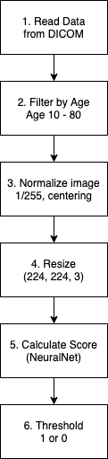
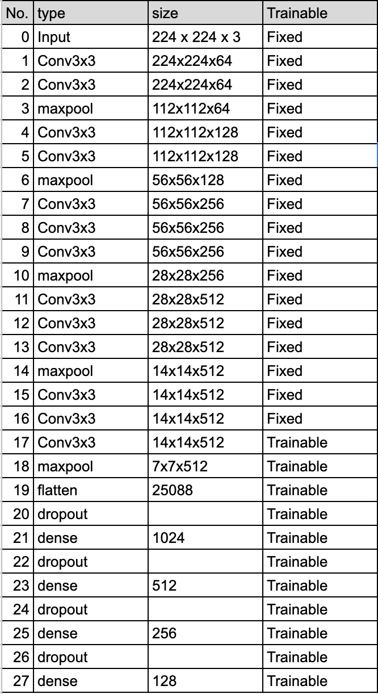

# FDA  Submission

**Your Name:**

AKiyuki Ishikawa

**Name of your Device:**

Pneumonia detection algorithm

## Algorithm Description h

### 1. General Information

**Intended Use Statement:** 

This algorithm is intended for assisting radiologist's detection of Pneumonia from 2D chest X-ray images.

**Indications for Use:**

This algorithm can be used to help radiologists' diagnosis process by notifying that the image may have Pneumonia.
If the diagnosis of the algorithm conflicts with radiologists, we can send the image to other radiologists and vote to get the final diagnosis.
The algorithm can be applied for chest X-ray images of patients in the range of 10-80 years old.
The image view position could be both PA and AP.

**Device Limitations:**

This algorithm trained to distinguish the following disease:

- Atelectasis
- Consolidation
- Infiltration
- Pneumothorax
- Edema
- Emphysema
- Fibrosis
- Effusion
- Pneumonia
- Pleural_thickening
- Cardiomegaly
- Nodule Mass
- Hernia

If input images have other diseases, the algorithm cannot provide meaningful results.

**Clinical Impact of Performance:**

By introducing the algorithm, we can reduce the human error made by radiologists.
If a radiologist made a false negative diagnosis, this algorithm could notify that the image has the possibility of Pneumonia and encourage further examination by other radiologists.

### 2. Algorithm Design and Function

Figure 1: Processing flowchart.

Figure 2: Model architecture.

**DICOM Checking Steps:**

DICOM data need to contains a chest x-ray image.
In the checking process, the following DICOM headers are examined:
- Body Part Examined: The examined part should be chest.
- Modality: The imaging modality should be "DX" (Radiography).
- Patient Position: The view position should be "PA" or "AP".

When the check script detects any violation, it outputs warning and encourages to confirm that the data include an appropriate image.

**Preprocessing Steps:**
In order to get the final result, we need to do the following steps.

1. Image data is extracted from DICOM.
2. The data is filtered by a patient's age since the algorithm assumed to use for a patient whose age is from 10 to 80.
3. The image data is normalized by rescaling to fit each intensity into the range 0-1 and centering the intensity for each channel.
4. Calculate score by using a trained neural net model. The score corresponds to the probability that the image have Pneumonia.
5. Binarize score by using a threshold.

**CNN Architecture:**

The model is trained by using the fine-tuning technique. The pre-trained VGG16 model is used as a base model and made the last convolution layer trainable(see, Figure 2 No.17).
The model includes additional dense and dropout layers. The detail is shown in Figure 2 No. 19 - 27.

### 3. Algorithm Training

**Parameters:**
* Types of augmentation used during training

During the training phase, the data augmentation is used in the following parameters:

1. Apply a random horizontal flip but does not apply a vertical flip.
2. Apply a random height and width shifts in the range of 10% of the image height and width, respectively.
3. Apply a random rotation around the center of the image in the range of 15 degrees.
4. Apply a random sheer in the range of 3 degrees.
5. Apply a random zoom in the range of 10% from the original image.

* Batch size

The batch size is set to 32.

* Optimizer learning rate

The learning rate is set to $1.0 \times 10^4$

* Layers of pre-existing architecture that were frozen

The first 17 layers, including the input-layer, are frozen, see also Figure 2.

* Layers of pre-existing architecture that were fine-tuned

The last VGG16 convolution layer is fine-tuned.

* Layers added to pre-existing architecture

Three Dense layers whose sizes are 1024, 512, 256 are added.

Figure 3: Time evolution of metrics.

Figure 4: Precision-Recall plot of the final model.

Figure 5: F1 score plot as a function of threshold.

**Final Threshold and Explanation:**

In order to determine the best threshold, the F1 score is calculated for each threshold.
The threshold 0.74 is chosen since at this point F1 score is maximized (see Figure 5).

### 4. Databases
 (For the below, include visualizations as they are useful and relevant)

**Description of Training Dataset:** 

Figure 6: Positive and negative ratio of training and validation dataset.

"NIH Chest X-ray Dataset"[1] is used to train and validate the model.
The dataset includes not only the "Pneumonia" label but also includes other labels like the "Atelectasis", "Consolidation" and so on, and each image can have multiple labels in a single entry.
For example, there is an entry which is labeled as "Cardiomegaly|Emphysema".

In the training phase, images of patients whose age is in the range of 10 - 80 are used.
The distribution of patient age is almost equal between training and the original dataset.

The 80% of the randomly selected data are used for training, and the rest of 20% of data are used for validations.

Since the ratio of positive ("Pneumonia") data is so small that negative entries of the training data are reduced and make positive and negative ratio have an equal ratio (Figure 6).

[1] https://www.kaggle.com/nih-chest-xrays/data

**Description of Validation Dataset:** 

Figure 7: Comparison of the distribution of disease labels between the original dataset and validation dataset.

The validation data are randomly extracted from the original dataset without overlap with the training data.
Since the number of positive ("Pneumonia") cases are too small, the ratio of positive and negative cases are arranged to make the ratio be 1:5. 
Unlike the training dataset, the ratio is unbalanced to reflect the real-world distribution.
Except for the "Pneumonia", the label distribution in the validation data has almost a similar distribution to the original dataset (see Figure 7).

Each patient may have multiple follow up images. When splitting the training and validation data, the images taken from the same patients are considered as different images. This means that validation data can include images from the patient whose other images are used in the training phase.

### 5. Ground Truth

The grand truth is labels that are extracted from radiologists' reports. The reports are analyzed by using Natural Language Processing. The labels are expected to be >90% accurate[2].

[2] http://openaccess.thecvf.com/content_cvpr_2017/papers/Wang_ChestX-ray8_Hospital-Scale_Chest_CVPR_2017_paper.pdf

### 6. FDA Validation Plan

**Patient Population Description for FDA Validation Dataset:**

We require a collection of chest x-ray image studies.
The diagnosed disease include the following diseases:

- Atelectasis
- Consolidation
- Infiltration
- Pneumothorax
- Edema
- Emphysema
- Fibrosis
- Effusion
- Pneumonia
- Pleural_thickening
- Cardiomegaly
- Nodule Mass
- Hernia

The distribution of the disease should reflect the distribution of the real world.

The patient's genders are equally distributed (50% female and 50% male). The patient's ages are from 10 to 80.

**Ground Truth Acquisition Methodology:**

The ground truth is obtained by biopsy. If it is difficult to apply biopsy, we use the voting result of the diagnosis from multiple radiologists.

**Algorithm Performance Standard:**

The diagnosis given by this algorithm is compared with ground truth and calculate the F1 score as a performance metric. The performance metrics can be assessed by comparing the F1 score of the radiologist.